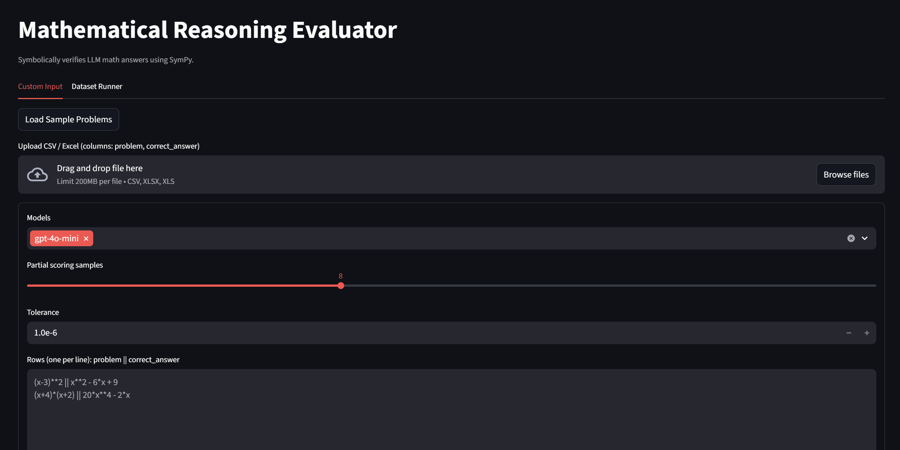
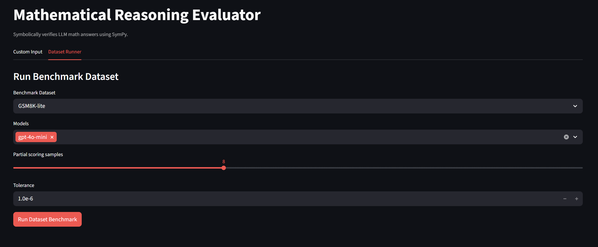
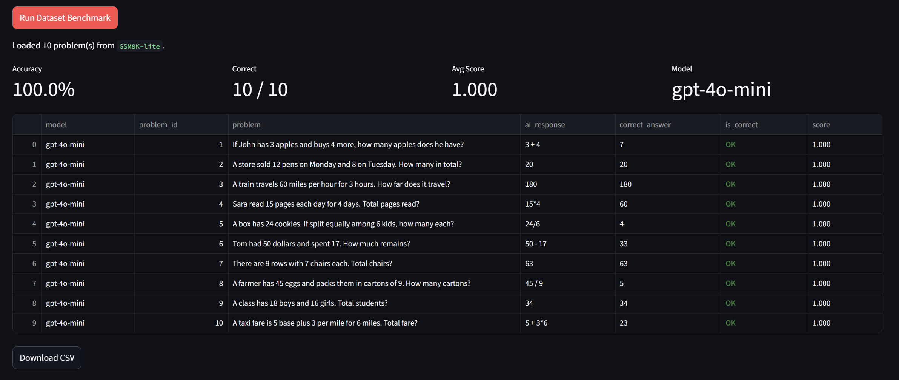

# Mathematical Reasoning Evaluator

Prototype evaluation tool for benchmarking LLM-generated mathematical answers using symbolic equivalence and randomized numeric validation with SymPy.

The project provides a small evaluation pipeline that can generate model answers, verify correctness, and produce benchmark metrics across datasets and models.

It is intended as a lightweight experimentation environment for studying LLM mathematical reasoning performance.

## Interface

### Custom Input Mode



Upload a dataset or paste problems directly and evaluate model responses.

### Dataset Benchmark Runner



Run built-in benchmark datasets and compare model accuracy.

### Example Results



Per-row scoring with symbolic validation and aggregated metrics.

## Features

- OpenAI-based answer generation (`ai_response`)
- Symbolic + sampled numeric scoring with SymPy
- Streamlit app with:
  - CSV/Excel upload (`problem`, `correct_answer`)
  - Paste/edit text mode (`problem || correct_answer`)
  - `Load Sample Problems` button
  - Problem count + row format validation
  - Summary metrics (Accuracy, Correct, Avg Score, Model)
  - Multi-model benchmark in one run (OpenAI models)
  - Built-in dataset runner (`GSM8K-lite`, `Symbolic Algebra`, `Calculus`)
  - Color-highlighted correctness (`OK`/`X`)
  - CSV download of evaluation results

## Evaluation Pipeline

The evaluator follows a simple pipeline:

```text
problem dataset
      ↓
LLM answer generation
      ↓
symbolic equivalence check (SymPy)
      ↓
numeric sampling fallback
      ↓
per-row scoring
      ↓
benchmark aggregation
```

## Project Structure

```text
app/
  core/
    config.py
    schemas.py
    helpers.py
    evaluator.py
    engine.py
    input/
      parsing.py
      samples.py
      datasets.py
    benchmark.py
  providers/
    base.py
    openai_provider.py
  stream_app.py
examples/
  sample_run.py
data/
  sample_data.xlsx
  benchmarks/
    gsm8k_lite.csv
    symbolic_algebra.csv
    calculus.csv
```

## Setup

```bash
python -m venv .venv
```

Windows PowerShell:

```powershell
.venv\Scripts\Activate.ps1
```

```bash
pip install -r requirements.txt
```

Create `.env` from `.env.example` and set:

```env
OPENAI_API_KEY=your_key_here
```

## Run

Streamlit UI:

```bash
streamlit run app/stream_app.py
```

CLI sample:

```bash
python examples/sample_run.py
```

or

```bash
python -m examples.sample_run
```

## Dataset File

You can directly upload the provided sample dataset from:

- `data/sample_data.xlsx`

Expected columns:

- `problem`
- `correct_answer`

## Dataset Runner

The app includes a benchmark runner with built-in datasets:

- `GSM8K-lite`
- `Symbolic Algebra`
- `Calculus`

In `Dataset Runner` tab:

1. Select dataset
2. Select one or more models
3. Click `Run Dataset Benchmark`

The app shows a model leaderboard table:

- `model`
- `accuracy`
- `correct`
- `total`
- `avg_score`
- `errors`

## Multi-Model Support

The app currently benchmarks multiple OpenAI models in one run.
Provider abstraction exists in `app/providers/`, so non-OpenAI providers can be added later.

## Programmatic Usage

```python
import pandas as pd
from app.core.evaluator import evaluate_dataframe

df = pd.DataFrame(
    [
        {
            "problem_id": 1,
            "problem": "(x+1)**2",
            "ai_response": "x**2 + 2*x + 1",
            "correct_answer": "x**2 + 2*x + 1",
        }
    ]
)

scored = evaluate_dataframe(df, ai_col="ai_response", correct_col="correct_answer")
print(scored[["problem_id", "problem", "ai_response", "correct_answer", "is_correct", "score"]])
```

## Limitations

This is an experimental evaluator and currently supports a limited subset of mathematical reasoning tasks.

Known limitations include:

- relies on SymPy-compatible expression parsing
- limited handling of inequalities and multi-step derivations
- numeric sampling may produce false positives in rare cases
- designed for experimentation rather than production benchmarking